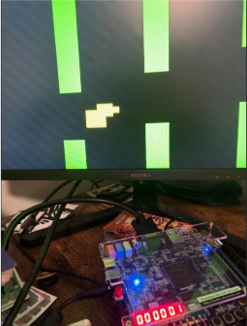

This repository contains the composition of my recreation of Flappy Bird on the DE1-SoC Development Board by Intel. This project displays embedded C fundamentals, such as memory mapping and configuring hardware-specific driver modules. All source code 
and the corresponding report is provided.

